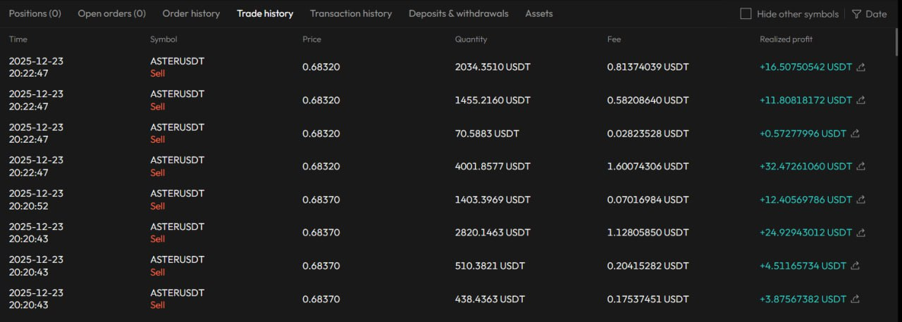
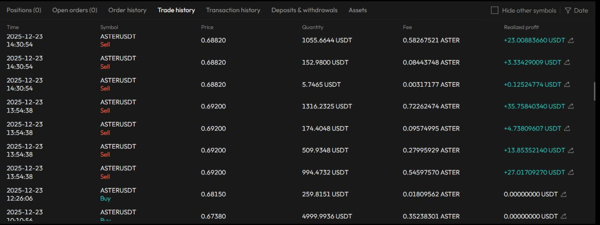
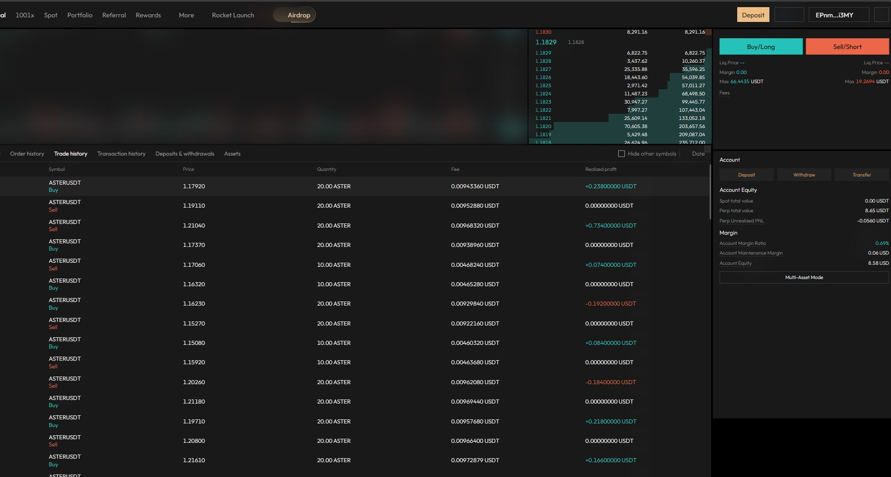
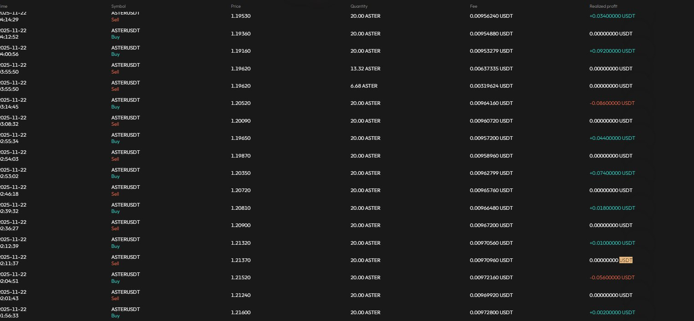
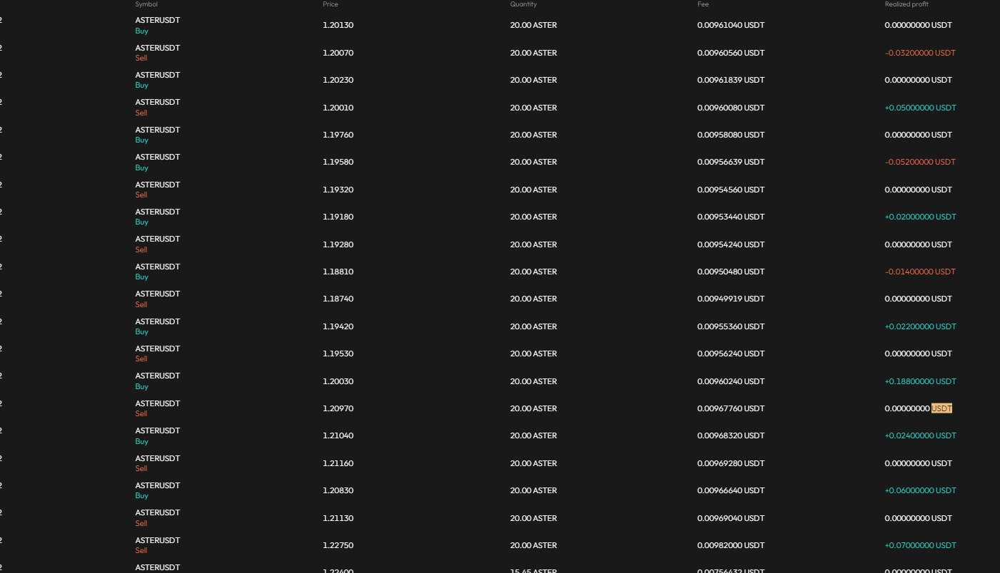
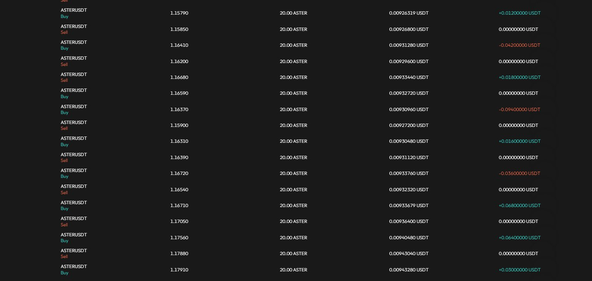

# Aster Trading Bot

An automated cryptocurrency trading bot for AsterDEX futures trading platform. The bot implements sophisticated trading strategies with comprehensive risk management, position tracking, and real-time market analysis.

My indicators have demonstrated reliable performance, generating an estimated 2.3%–7.4% profit during 95 hours of testing.
To support the developer, contributions in USDT (Sol) can be sent to:
4F5oYCAWYnUxr6QWudXjn8wEeDSCsaQJhUknZNe9UF18

## Test Results

The bot has been extensively tested with real trading data. Below are screenshots and a recording showing the bot's performance on the AsterDEX platform.

### Performance Screenshots


*Trade history showing profitable sell transactions*


*Additional trade history entries with realized profits*


*More trade history showing consistent profitable trades*


*Trade history with various buy and sell transactions*


*Detailed trade history showing price movements and profits*


*Trade history displaying realized profits in USDT*


*Additional trade history entries with profit/loss details*

### Performance Recording

<video width="800" controls>
  <source src="./public/20251120-1126-48.9121792.mp4" type="video/mp4">
  Your browser does not support the video tag.
</video>

*Video recording of the bot's trading activity and performance*

## Features

- **Dual Strategy Support**: 
  - Watermellon Strategy: EMA-based trend following with RSI confirmation
  - Peach Hybrid Strategy: Dual-system approach combining trend bias (V1) and momentum surge (V2)
  
- **Advanced Risk Management**:
  - Configurable position sizing and leverage limits
  - Stop-loss and take-profit mechanisms
  - Emergency stop-loss protection
  - Trailing stop-loss for profit protection
  - Maximum flips per hour limit
  - Consecutive loss protection
  
- **Real-time Market Analysis**:
  - ADX for market regime detection (trending vs ranging)
  - ATR for dynamic stop-loss placement
  - RSI for momentum confirmation
  - Support/resistance level tracking
  
- **Position Management**:
  - Automatic position reconciliation with exchange
  - State persistence across restarts
  - Order tracking and confirmation
  - Flip prevention (minimum hold time)
  
- **Comprehensive Logging**:
  - Trade entry/exit logging
  - Signal analysis and filtering
  - Daily CSV and JSON trade logs
  - Real-time console output

## Prerequisites

- Node.js 18+ and npm
- AsterDEX account with API credentials
- TypeScript knowledge (for development)

## Installation

1. Clone the repository:
```bash
git clone <repository-url>
cd aster-bot
```

2. Install dependencies:
```bash
npm install
```

3. Copy the example environment file:
```bash
cp env.example .env.local
```

4. Configure your environment variables in `.env.local` (see Configuration section)

## Configuration

### Required Environment Variables

```env
ASTER_RPC_URL=https://fapi.asterdex.com
ASTER_WS_URL=wss://fstream.asterdex.com/ws
ASTER_API_KEY=your_api_key
ASTER_API_SECRET=your_api_secret
WALLET_PRIVATE_KEY=your_private_key
PAIR_SYMBOL=ASTERUSDT-PERP
MODE=dry-run
```

### Risk Management Settings

```env
MAX_POSITION_USDT=10000
MAX_LEVERAGE=5
MAX_FLIPS_PER_HOUR=12
STOP_LOSS_PCT=0
TAKE_PROFIT_PCT=0
USE_STOP_LOSS=false
EMERGENCY_STOP_LOSS_PCT=2.0
MAX_POSITIONS=1
REQUIRE_TRENDING_MARKET=true
ADX_THRESHOLD=25
```

### AI Stop-Loss (Optional)

Enable AI-powered stop-loss suggestions using [BlockRun LLM](https://blockrun.ai):

```env
AI_STOPLOSS_ENABLED=true
BASE_CHAIN_WALLET_KEY=0x...your_private_key...
```

**Setup:**
1. Create a Base wallet (or use existing)
2. Fund it with USDC on Base network
3. Set `BASE_CHAIN_WALLET_KEY` to your wallet's private key
4. Set `AI_STOPLOSS_ENABLED=true`

**How it works:**
- When entering a trade, AI analyzes recent price volatility
- Suggests optimal stop-loss (0.5%-3%) based on market conditions
- Cost: ~$0.003 per trade (Claude Sonnet via BlockRun x402 micropayments)

**Note:** Your private key is used only for local signing - it never leaves your machine.

**Note**: `MAX_LEVERAGE` must be one of the supported values: **5, 10, 15, or 50**. AsterDEX only accepts these specific leverage multipliers.

### Strategy Selection

Set `STRATEGY_TYPE` to either:
- `watermellon`: EMA-based trend following strategy
- `peach-hybrid`: Dual-system hybrid strategy (default)

### Strategy Parameters

#### Watermellon Strategy
```env
EMA_FAST=8
EMA_MID=21
EMA_SLOW=48
RSI_LENGTH=14
RSI_MIN_LONG=42
RSI_MAX_SHORT=58
```

#### Peach Hybrid Strategy

**V1 System (Trend/Bias)**:
```env
PEACH_V1_EMA_FAST=8
PEACH_V1_EMA_MID=21
PEACH_V1_EMA_SLOW=48
PEACH_V1_EMA_MICRO_FAST=5
PEACH_V1_EMA_MICRO_SLOW=13
PEACH_V1_RSI_LENGTH=14
PEACH_V1_RSI_MIN_LONG=42.0
PEACH_V1_RSI_MAX_SHORT=58.0
PEACH_V1_MIN_BARS_BETWEEN=1
PEACH_V1_MIN_MOVE_PCT=0.10
```

**V2 System (Momentum Surge)**:
```env
PEACH_V2_EMA_FAST=3
PEACH_V2_EMA_MID=8
PEACH_V2_EMA_SLOW=13
PEACH_V2_RSI_MOMENTUM_THRESHOLD=3.0
PEACH_V2_VOLUME_LOOKBACK=4
PEACH_V2_VOLUME_MULTIPLIER=1.5
PEACH_V2_EXIT_VOLUME_MULTIPLIER=1.2
```

### Timeframe Configuration

```env
VIRTUAL_TIMEFRAME_MS=30000
```

## Usage

### Running in Dry-Run Mode

Test the bot without executing real trades:

```bash
npm run bot
```

The bot will simulate trades and log all actions without placing actual orders.

### Running in Live Mode

⚠️ **WARNING**: Live mode executes real trades with real money!

1. Set `MODE=live` in your `.env.local`
2. Review all risk settings carefully
3. Start with small position sizes
4. Run the bot:

```bash
npm run bot
```

The bot will display a 5-second warning before starting in live mode.

## Strategies

### Watermellon Strategy

A trend-following strategy that uses:
- **EMA Stack**: Fast (8), Mid (21), and Slow (48) EMAs for trend detection
- **RSI Filter**: Confirms signals with RSI thresholds
- **ADX Filter**: Only trades in trending markets (ADX > threshold)
- **Signal Generation**: 
  - Long: Bullish EMA stack + RSI > 42
  - Short: Bearish EMA stack + RSI < 58

### Peach Hybrid Strategy

A dual-system approach combining two complementary strategies:

#### V1 System (Trend/Bias)
- Uses EMA stacks (main + micro) for trend bias detection
- RSI confirmation for entry signals
- Minimum bars between signals to prevent overtrading
- Minimum price move requirement

#### V2 System (Momentum Surge)
- Detects RSI momentum surges
- Volume spike confirmation
- Volume color analysis (bullish/bearish)
- EMA direction alignment

**Exit Conditions**:
- RSI flattening with volume drop
- RSI reversal against position
- Trailing stop-loss activation
- Emergency stop-loss triggers

## Risk Management Features

### Position Limits
- **Max Position Size**: Maximum USDT value per position
- **Max Leverage**: Maximum leverage multiplier (must be 5, 10, 15, or 50)
- **Max Positions**: Maximum concurrent positions (typically 1)

### Flip Prevention
- **Max Flips Per Hour**: Limits position reversals
- **Minimum Hold Time**: Prevents instant position flips (5 minutes default)

### Stop-Loss Protection
- **Emergency Stop-Loss**: Hard stop at configured percentage (1% for Peach, 2% default)
- **Trailing Stop-Loss**: Dynamic stop that follows price (0.3% for Peach)
- **Regular Stop-Loss**: Configurable percentage-based stop
- **AI-Powered Stop-Loss**: Uses LLM to suggest optimal stop-loss based on market volatility (powered by BlockRun)

### Market Regime Filtering
- **ADX Threshold**: Only trades when market is trending (ADX > threshold)
- **Require Trending Market**: Enables/disables market regime filter

### Loss Protection
- **Consecutive Loss Limit**: Stops trading after 2 consecutive losses
- **Risk/Reward Ratio**: Requires minimum 2:1 R:R for Peach Hybrid signals

## Project Structure

```
aster-bot/
├── src/
│   ├── bot/
│   │   └── index.ts              # Main bot entry point
│   ├── lib/
│   │   ├── ai-stoploss/
│   │   │   └── index.ts          # AI-powered stop-loss
│   │   ├── bot/
│   │   │   └── botRunner.ts      # Core bot logic
│   │   ├── execution/
│   │   │   ├── dryRunExecutor.ts # Simulated execution
│   │   │   ├── liveExecutor.ts   # Real trade execution
│   │   │   └── orderTracker.ts   # Order confirmation tracking
│   │   ├── indicators/
│   │   │   ├── adx.ts            # ADX indicator
│   │   │   ├── atr.ts            # ATR indicator
│   │   │   ├── ema.ts            # EMA indicator
│   │   │   └── rsi.ts            # RSI indicator
│   │   ├── logging/
│   │   │   └── tradeLogger.ts    # Trade logging system
│   │   ├── rest/
│   │   │   └── restPoller.ts     # REST API polling
│   │   ├── security/
│   │   │   └── keyManager.ts     # API key protection
│   │   ├── state/
│   │   │   ├── positionState.ts  # Position state management
│   │   │   └── statePersistence.ts # State persistence
│   │   ├── config.ts             # Configuration loader
│   │   ├── peachHybridEngine.ts  # Peach Hybrid strategy
│   │   ├── watermellonEngine.ts  # Watermellon strategy
│   │   ├── tickStream.ts         # WebSocket tick stream
│   │   ├── types.ts              # TypeScript types
│   │   └── virtualBarBuilder.ts  # Virtual bar construction
│   └── app/                      # Next.js web interface
├── data/
│   └── trades/                   # Trade logs directory
├── env.example                    # Environment template
└── package.json
```

## Development

### Running Tests

The bot includes test files for development:
- `test-bot.ts`: Basic bot testing
- `test-step-by-step.ts`: Step-by-step execution testing

### Building

```bash
npm run build
```

### Linting

```bash
npm run lint
```

## Logging

Trade logs are stored in `data/trades/daily/`:
- **CSV Format**: `trades-YYYY-MM-DD.csv` - Spreadsheet-compatible trade data
- **JSON Format**: `trades-YYYY-MM-DD.json` - Detailed trade information
- **Signals**: `signals-YYYY-MM-DD.json` - All signals (taken and skipped)

Logs include:
- Entry/exit prices and timestamps
- P&L calculations
- Indicator values at entry/exit
- Market conditions
- Risk parameters
- Signal reasons and filters

## State Persistence

The bot automatically saves state to `data/bot-state.json`:
- Current position state
- Last bar close time
- State is loaded on restart (if less than 1 hour old)

## Security

- **Key Protection**: API keys are automatically redacted in logs
- **Safe Logging**: KeyManager ensures sensitive data is never logged
- **Environment Variables**: All credentials stored in `.env.local` (not committed)

## Deployment

### PM2 Deployment

The project includes `ecosystem.config.js` for PM2 process management:

```bash
pm2 start ecosystem.config.js
pm2 save
pm2 startup
```

### Systemd Service

A systemd service file (`watermellon-bot.service`) is included for Linux deployments.

## Monitoring

Monitor bot activity through:
- Console output (real-time logs)
- Trade log files (CSV/JSON)
- PM2 logs: `pm2 logs aster-bot`
- System logs (if using systemd)

## Troubleshooting

### Bot Not Starting
- Check all required environment variables are set
- Verify API credentials are correct
- Ensure network connectivity to AsterDEX

### No Trades Executing
- Check market regime filters (ADX threshold)
- Verify position size and leverage settings
- Review signal logs to see why signals are skipped
- Check balance is sufficient

### Position Reconciliation Failures
- Bot automatically freezes trading after 2 failures
- Check REST API connectivity
- Verify position on exchange matches bot state

## Important Warnings

⚠️ **Trading cryptocurrencies involves substantial risk of loss**

- Always test in dry-run mode first
- Start with small position sizes
- Never risk more than you can afford to lose
- Monitor the bot regularly
- Keep API keys secure
- Review trade logs frequently
- Understand the strategies before using them

## License

This project is private and proprietary.

## Support

For issues or questions:
1. Review the configuration settings
2. Check trade logs for signal analysis
3. Review console output for errors
4. Verify API credentials and connectivity
### Telegram : https://t.me/blacksky_jose
---

**Disclaimer**: This bot is provided as-is. Trading cryptocurrencies carries significant risk. Past performance does not guarantee future results. Use at your own risk.

